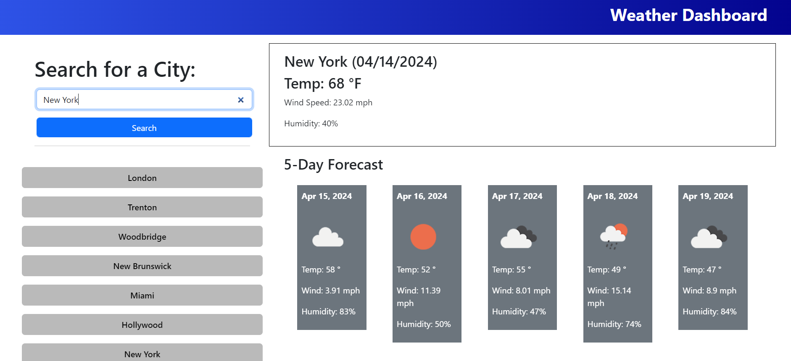

  # Weather Forecast
  

  ## Table of Contents
  - [Usage](#usage)
  - [Credits](#credits)
  - [License](#license)
  - [Feature](#features)
  - [Screenshot](#screenshot)
  - [Questions](#questions)
  - 
  ## Description
  This web application provides a weather forecast for any city worldwide. Users can input their desired city, and the app retrieves the current weather conditions along with a 5-day forecast. The app also logs the user's inputted cities, creating a history for easy reference.

https://wabreu738.github.io/weather-forecast/

  ## Installation
  To run the Weather Forecast App locally on your machine, follow these steps:
  1) Clone this repository to your local machine 
  2) Open the index.html file in your preferred web browser. 
  3) Start using the app as described in the "Usage" section below.

  ## Usage
  1) Enter the name of the city for which you want to check the weather forecast in the input field provided.
  2) Click on the "Search" button or press "Enter" to retrieve the weather forecast.
  3) The app will display the current weather conditions, including temperature, wind speed, and humidity, along with a 5-day forecast
  4) To view the weather forecast for another city, simply repeat steps 1-3

  ## Credits
  N/A

  
  ## License 
  

  This project is licensed under MIT
  For more information on license please click the [Link](https://opensource.org/licenses/MIT)
  

  ## Features
  Weather Forecast: Get the current weather conditions and a 5-day forecast for any city.
  City History: View a history of previously searched cities for quick access.Responsive 
  Design: The app is optimized for both desktop and mobile devices.

  ## Screenshot
  
 

  ## Questions
  For more check out my [GitHub](https://github.com/WAbreu738) 
  
  If you have any questions feel free to reach me at wesleyabreu738@gmail.com.👋
 
